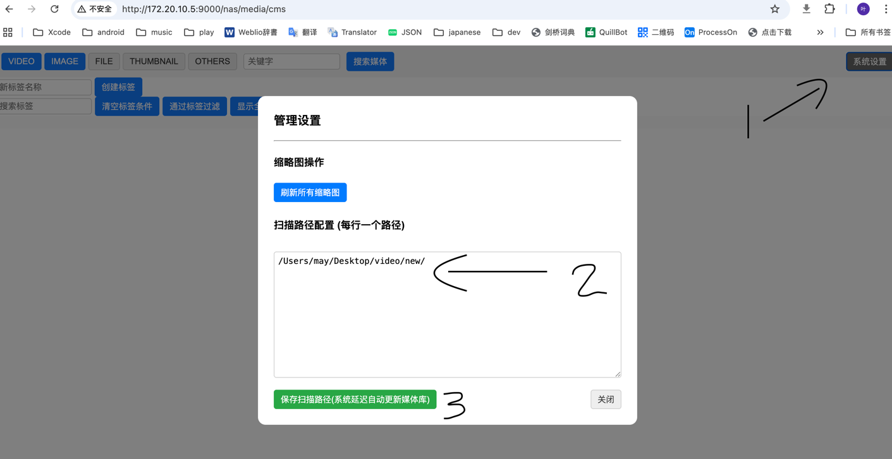

# 1. 项目说明

B/S架构设计的软件。
功能：扫描本机指定目录视频图片作为为一个简易的自建NAS。

## 2. 注意 环境要求
```text
1 运行server的环境要求有 ffmpeg （构建媒体库缩略图用）
2 JDK 17
3 本应用使用内嵌h2 db运行，最小化依赖设计
```

## 3. 页面地址（注意替换您server的实际IP和端口「log中有打印」）
* 「为了让自签名 HTTPS 在开发环境中的浏览器里能正常跑通，别用环回IP（127.0.0.1），得用电脑的实际 IP 地址。」
* 「原因是：自签名证书在浏览器页面中会被浏览器默认逻辑引导至信任同意。否则js中（用的是server的实际 IP 地址）的https请求可能无法正确加载」


### 多媒体内容管理页面（CMS）
https://172.20.10.5:9000/nas/media/cms



### 图片浏览页

https://172.20.10.5:9000/nas/media/image

### 视频浏览页「目前只支持mp4格式视频由于web播放器限制的缘故」

https://172.20.10.5:9000/nas/media/video


## 4. todo

```text
. 视频文件格式的支持问题（转码到统一格式）
.  缩略图生成的触发时机逻辑优化
.  db 模拟mq处理

```